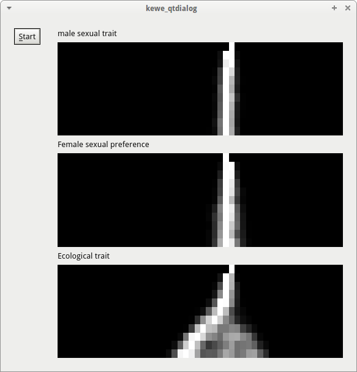
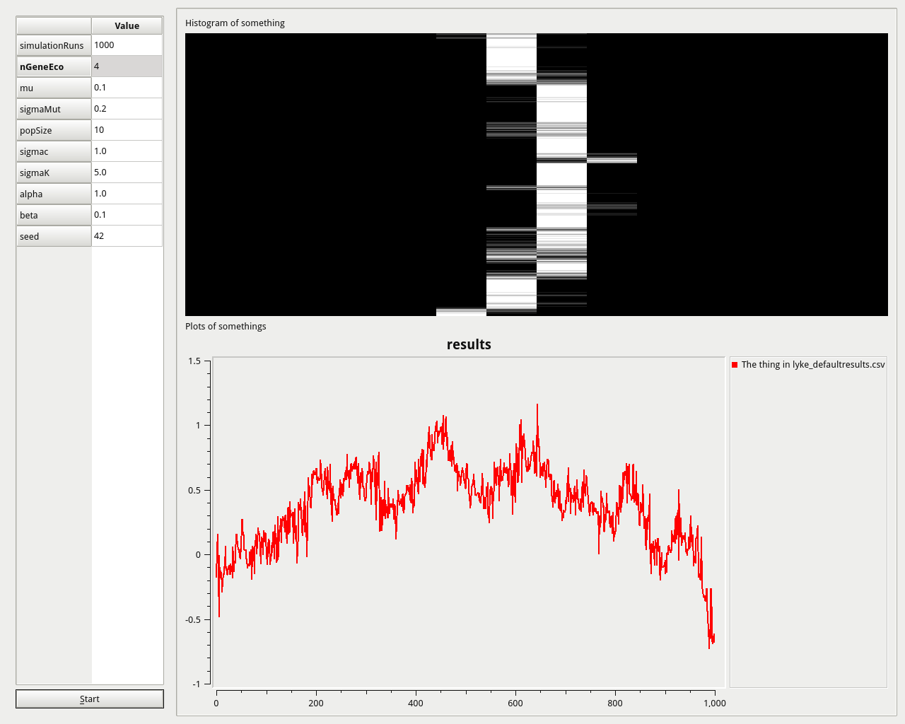
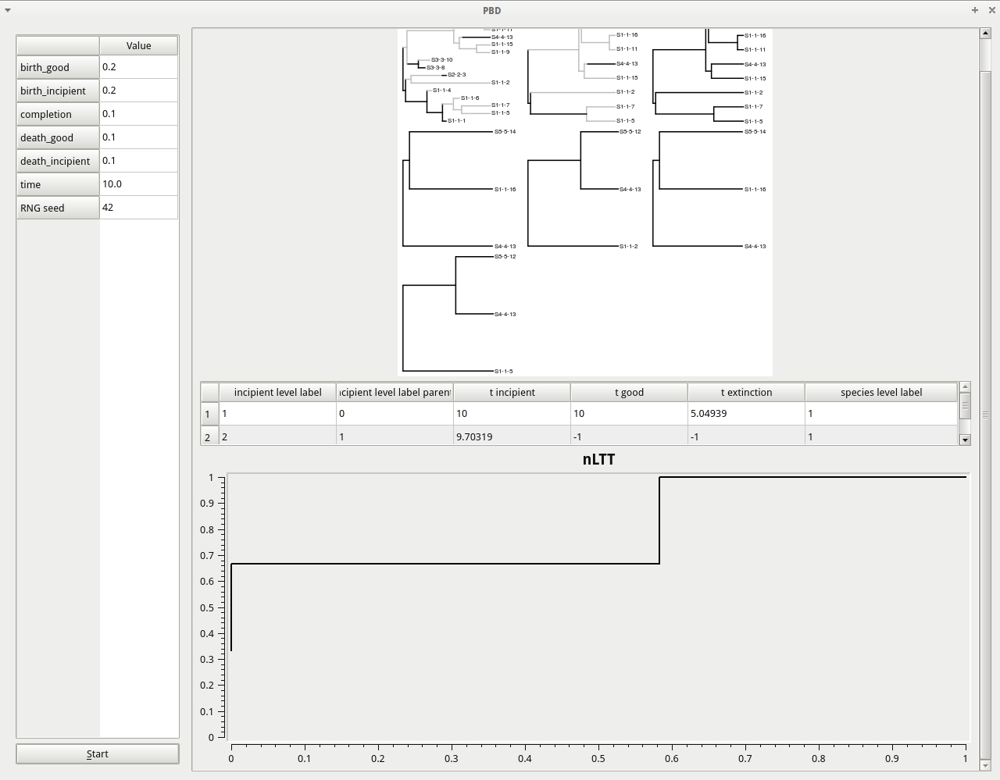
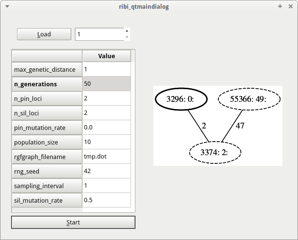

# pbdmms

Branch||
---|---|---
master||
cine||
jobo||
kewe||
lyke||
jaan||
ribi||

## Screenshots

## Installation

 * `apt-get install graphviz qtcreator`
 * `./download_other_githubs.sh`

## Building

Either load the `.pro` file from Qt Creator, or use `qmake` to build:

 * `qmake my.pro`: creates a makefile
 * `make`: build that makefile

## Contributing, code guidelines

See [CONTRIBUTING.md](CONTRIBUTING.md).

## Schedule

 * 2016-09-05: First day `jobo` and `kewe`
 * 2016-11-17 9:30 Progress meeting `jobo`, `kewe`, `ribi` and Rampal
 * 2016-11-17: Midterm progress meeting `jobo`
 * 2016-12-12: First full version of BDM-model `jobo`
 * 2016-12-14 9:30 TECE meeting
 * 2017-01-03: ?Midterm progress meeting `kewe`
 * 2017-01-?? 9:30 TECE meeting
 * 2017-02-10: Final day `jobo`
 * 2017-?03-??: Final day `kewe`

## Articles used

 * Etienne, Rampal S., and James Rosindell. "Prolonging the past counteracts the pull of the present: protracted speciation can explain observed slowdowns in diversification." Systematic Biology (2012): syr091.
 * Etienne, Rampal S., Helene Morlon, and Amaury Lambert. "Estimating the duration of speciation from phylogenies." Evolution 68.8 (2014): 2430-2440.
 * van Doorn, G. Sander, and Franz J. Weissing. "Ecological versus sexual selection models of sympatric speciation: a synthesis." Selection 2.1-2 (2002): 17-40.

## Articles in preparation

The article(s)-in-progress are put in private repositories:

 * [ribi](https://github.com/richelbilderbeek/distancer_article)

